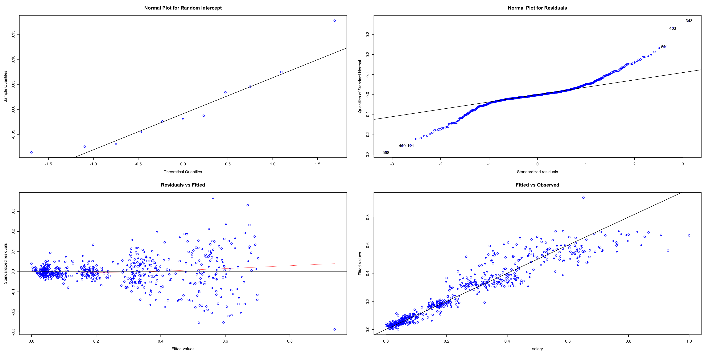

# Abstract

People intuitively associate their wage level with their cost of living. Since the purchasing power of the currency unit varies from country to country, their cost of living also varies. This paper utilizes a commonly accepted linear mixed model with group level `region` to capture the relationship between average monthly salary and factors of cost of living by using almost 5000 cities across the world. We found that the cost of living, such as food, oil and rent, varies significantly depending on the region. But within the same region, there is no big difference between cities, they are all at the same level. Secondly, people's wage level and living standard consumption do significantly correlate. There is also an interaction between the various components of the cost of living.

**Keywords**: Multilevel model; cost of living; salary.

```{r setup, include=FALSE}
knitr::opts_chunk$set(echo = TRUE)
pacman::p_load(ggplot2,rstanarm,tidyverse,lme4,colorspace,scales,glmnet,predictmeans,modelr,merTools,PerformanceAnalytics,cowplot)
```

# 1. Introduction

According to historical articles indicated in (Grimes, Prime, & Walker, 2019), in the United States, urban leaders in various cities struggle to create conditions that improve job opportunities and raise incomes. And the paper's research proves that urban areas are more productive, which leads to higher wages, despite the higher cost of living One of the most critical variables to consider when assessing wages in different geographic areas is the regional cost of living. In the absence of regional studies on how the cost of living affects wage levels, our paper here offers four contributions: The first is to study a linear model of the cost of living and wage levels under a global scenario. The second is to find out the influences of fixed effects (e.g. basic foods, gasoline, rent and so on) and random effects (region/country). Finally, we examine a linear mixed model of cost of living and wage levels at a regional scale. The remaining parts of this paper present the methodology of the study, a evaluation, the empirical results, a discussion.

# 2. Data and Methodology

## 2.1 data wrangling

I found the data set from a public website (<https://www.kaggle.com/datasets/mvieira101/global-cost-of-living>).

Here is the data dictionary.

| **Column** | **Description**                                                                |
|-------------------------|----------------------------------------------|
| city       | Name of the city                                                               |
| region     | Name of the country                                                            |
| x1         | Meal, Inexpensive Restaurant (USD)                                             |
| x2         | Meal for 2 People, Mid-range Restaurant, Three-course (USD)                    |
| x3         | McMeal at McDonalds (or Equivalent Combo Meal) (USD)                           |
| x4         | Domestic Beer (0.5 liter draught, in restaurants) (USD)                        |
| x5         | Imported Beer (0.33 liter bottle, in restaurants) (USD)                        |
| x6         | Cappuccino (regular, in restaurants) (USD)                                     |
| x7         | Coke/Pepsi (0.33 liter bottle, in restaurants) (USD)                           |
| x8         | Water (0.33 liter bottle, in restaurants) (USD)                                |
| x9         | Milk (regular), (1 liter) (USD)                                                |
| x10        | Loaf of Fresh White Bread (500g) (USD)                                         |
| x11        | Rice (white), (1kg) (USD)                                                      |
| x12        | Eggs (regular) (12) (USD)                                                      |
| x13        | Local Cheese (1kg) (USD)                                                       |
| x14        | Chicken Fillets (1kg) (USD)                                                    |
| x15        | Beef Round (1kg) (or Equivalent Back Leg Red Meat) (USD)                       |
| x16        | Apples (1kg) (USD)                                                             |
| x17        | Banana (1kg) (USD)                                                             |
| x18        | Oranges (1kg) (USD)                                                            |
| x19        | Tomato (1kg) (USD)                                                             |
| x20        | Potato (1kg) (USD)                                                             |
| x21        | Onion (1kg) (USD)                                                              |
| x22        | Lettuce (1 head) (USD)                                                         |
| x23        | Water (1.5 liter bottle, at the market) (USD)                                  |
| x24        | Bottle of Wine (Mid-Range, at the market) (USD)                                |
| x25        | Domestic Beer (0.5 liter bottle, at the market) (USD)                          |
| x26        | Imported Beer (0.33 liter bottle, at the market) (USD)                         |
| x27        | Cigarettes 20 Pack (Marlboro) (USD)                                            |
| x28        | One-way Ticket (Local Transport) (USD)                                         |
| x29        | Monthly Pass (Regular Price) (USD)                                             |
| x30        | Taxi Start (Normal Tariff) (USD)                                               |
| x31        | Taxi 1km (Normal Tariff) (USD)                                                 |
| x32        | Taxi 1hour Waiting (Normal Tariff) (USD)                                       |
| x33        | Gasoline (1 liter) (USD)                                                       |
| x34        | Volkswagen Golf 1.4 90 KW Trendline (Or Equivalent New Car) (USD)              |
| x35        | Toyota Corolla Sedan 1.6l 97kW Comfort (Or Equivalent New Car) (USD)           |
| x36        | Basic (Electricity, Heating, Cooling, Water, Garbage) for 85m2 Apartment (USD) |
| x37        | 1 min. of Prepaid Mobile Tariff Local (No Discounts or Plans) (USD)            |
| x38        | Internet (60 Mbps or More, Unlimited Data, Cable/ADSL) (USD)                   |
| x39        | Fitness Club, Monthly Fee for 1 Adult (USD)                                    |
| x40        | Tennis Court Rent (1 Hour on Weekend) (USD)                                    |
| x41        | Cinema, International Release, 1 Seat (USD)                                    |
| x42        | Preschool (or Kindergarten), Full Day, Private, Monthly for 1 Child (USD)      |
| x43        | International Primary School, Yearly for 1 Child (USD)                         |
| x44        | 1 Pair of Jeans (Levis 501 Or Similar) (USD)                                   |
| x45        | 1 Summer Dress in a Chain Store (Zara, H&M, ...) (USD)                         |
| x46        | 1 Pair of Nike Running Shoes (Mid-Range) (USD)                                 |
| x47        | 1 Pair of Men Leather Business Shoes (USD)                                     |
| x48        | Apartment (1 bedroom) in City Centre (USD)                                     |
| x49        | Apartment (1 bedroom) Outside of Centre (USD)                                  |
| x50        | Apartment (3 bedrooms) in City Centre (USD)                                    |
| x51        | Apartment (3 bedrooms) Outside of Centre (USD)                                 |
| x52        | Price per Square Meter to Buy Apartment in City Centre (USD)                   |
| x53        | Price per Square Meter to Buy Apartment Outside of Centre (USD)                |
| x54        | Average Monthly Net Salary (After Tax) (USD)                                   |
| salary     | Mortgage Interest Rate in Percentages (%), Yearly, for 20 Years Fixed-Rate     |

Firstly, I download cost of living data and wiped out 'NA' data. Then, I rename country column as region to avoid politic dispute. Then I chose the data that only countries has more than 30 cities, because Associated with the classical between-subjects design ANOVA, we generally require that the sample size of each group should not be too small, at least 30\~50 subjects to ensure power. The suitable regions are as follows. *China, Mexico, Brazil, Germany, Spain, United Kingdom, Canada, Italy, Russia, United States, India*. Additionally, after I analyze the statistics of these data, I find that they are not in the same scale, hence, I normalize these data at the scale of 0 to 1.

Secondly, I use Lasso Regression to chose variables that is fit in my linear regression model, according to the outcome of lasso regression, by deleting the variables that doesn't display coefficients.

```{r include=FALSE}
## Data Cleaning
df1 <- read.csv("~/Desktop/MSSP/MA678/ma678-midterm_project/cost-of-living.csv")
df1 <- df1 %>% 
  rename("salary" = "x54",
         "region" = "country") %>% 
  dplyr::select(-X, -data_quality) %>% 
  na.omit()
```

```{r include=FALSE}
##select the countries that have more than 30 cities, in order to ensure the power of level 2.
table(df1$region)
df2 <- df1 %>% filter(      region=="China" |
                            region=="Mexico"| 
                            region=="Brazil"| 
                            region=="Germany"| 
                            region=="Spain"| 
                            region=="United Kingdom"|
                            region=="Canada"| 
                            region=="Italy"| 
                            region=="Russia"| 
                            region=="United States"|
                            region== "India")
df2 <- df2[,c(1,2,56,3:55,57)]
```

```{r include=FALSE}
summary(df2) # We found that they are not in the same scale.
```

```{r include=FALSE}
## Normalize the data
normalize <- function(x) { 
  x <- as.matrix(x)
  minAttr=apply(x, 2, min)
  maxAttr=apply(x, 2, max)
  x <- sweep(x, 2, minAttr, FUN="-") 
  x=sweep(x, 2,  maxAttr-minAttr, "/") 
  attr(x, 'normalized:min') = minAttr
  attr(x, 'normalized:max') = maxAttr
  return (x)
} 
df3 <- normalize(df2[3:57]) 
df3 <- as.data.frame(df3)
df4 <- df2 %>% 
  dplyr::select(-c(3:57)) %>% 
  mutate(df3)
```

```{r include=FALSE}
#define response variable
y <- df4$salary

#define matrix of predictor variables
x <- data.matrix(df4[, 4:57])
```

```{r include=FALSE}
library(glmnet)

#perform k-fold cross-validation to find optimal lambda value
cv_model <- cv.glmnet(x, y, alpha = 1)

#find optimal lambda value that minimizes test MSE
best_lambda <- cv_model$lambda.min
best_lambda

#produce plot of test MSE by lambda value
plot(cv_model) 
```

```{r include=FALSE}
#find coefficients of best model
best_model <- glmnet(x, y, alpha = 1, lambda = best_lambda)
coef(best_model)
```

Hence, the variables x5, x6, x7, x8, x9, x12, x15,x16, x18, x22, x24, x25, x26, x28, x31, x32, x33, x37, x38, x39, x41, x42, x44, x47, x48, x49, x51 x53, and x55 are suitable. However, they are many variables having the same meaning and belongs to one aspect, and I will chose 3 independent variables , **basic food**, **gasoline**, **rent**, because I found it is hard for me to identify random slope and intercept if it I want to analyze 10 variables' interaction and their fixed effects and random effects.

```{r include=FALSE}
## Hence, the variables x5, x6, x7, x8, x9, x12, x15,x16, x18, x22, x24, x25, x26, x28, x31, x32, x33, x37, x38, x39, x41, x42, x44, x47, x48, x49, x51 x53, and x55. However, they are many variables having the same meaning and belongs to one aspect, and I will chose 3 independent variables to represent them, because I found it is hard for me to identify random slope and intercept if it has 10 variables.
df5 <- df4 %>% dplyr::select("city","region","salary","x8","x33", "x51") %>% 
  rename("basic_food" = "x8",
         "gasoline" = "x33",
         "rent" = "x51")
```

## 2.2 Exploratory Data Analysis

Figure 1 shows the salary distribution of different country. From this figure, we can find that the United States has a highest based salary among these countries.

```{r echo=FALSE, fig.height=4, fig.width=8, fig.cap="salary distribution of different regions"}
ggplot(data = df5,mapping = aes(x=region,
                                     y=salary, color = factor(region)))+
  theme(axis.text.x=element_text(angle=90, hjust=1))+
  geom_point()
```

```{r echo=FALSE, fig.height=5, fig.width=7, fig.cap="factors of cost of living vs salary"}
## basic food
plot1 <- ggplot(data = df5)+
  aes(y=salary,x=basic_food)+
  geom_point(alpha = 0.3,aes(color = region))+
  labs(title = "salary vs basic food price",
       x="basic food",
       y="salary",
       colour = "region")  + 
  geom_smooth(aes(color = region),se=F,method = "lm",formula = 'y ~ x') + 
  theme(legend.key.size = unit(0.1, 'cm'),
        legend.position="bottom")

## gasoline
plot2 <- ggplot(data = df5)+
  aes(y=salary,x=gasoline)+
  geom_point(alpha = 0.3,aes(color = region))+
  labs(title = "salary vs gasoline",
       x="gasoline",
       y="salary",
       colour = "region")  + 
  geom_smooth(aes(color = region),se=F,method = "lm",formula = 'y ~ x') + 
  theme(legend.key.size = unit(0.1, 'cm'),
        legend.position="bottom")

## rent
plot3 <- ggplot(data = df5)+
  aes(y=salary,x=rent)+
  geom_point(alpha = 0.3,aes(color = region))+
  labs(title = "salary vs rent price",
       x="rent",
       y="salary",
       colour = "region")  + 
  geom_smooth(aes(color = region),se=F,method = "lm", formula = 'y ~ x') + 
  theme(legend.key.size = unit(0.1, 'cm'),
        legend.position="bottom")
plot_grid(plot1, plot2, plot3, labels=c("A", "B","C"), ncol = 3, nrow = 1)
```

Figure 2 shows the linear regression lines between different factors of cost of living and salary. It is easy to find that basic food have varying intercept but with roughly similar slopes. As for gasoline,it has different intercept and slopes. And for rent price factor,it has different intercept but obviously similar slopes.

# 3. Evaluation

## 3.1 Model fitting

I use method ANOVA to compare different models I built, because I want to include the variables' interactions effect in my linear model, which also is the level 1 model. According to the results, we find that interactions **basic_food:gasoline** and **basic_food:rent** have significant influence in this model.

```{r include=FALSE}
m1 <- lm(salary ~ basic_food + gasoline + rent, data = df5)
summary(m1)
```

```{r include=FALSE}
m3 <- update(m1,.~. + basic_food*gasoline)
m4 <- update(m1,.~. + basic_food*rent)
m5 <- update(m1,.~. + rent*gasoline)
anova(m1,m3)
anova(m1,m4)
anova(m1,m5)
```

```{r include=FALSE}
m6 <- update(m3,.~. + basic_food*rent)
m7 <- update(m3,.~. + rent*gasoline)
anova(m3,m6)
anova(m3,m7)
```

Hence, the final linear model I build is:

```{r}
lm1 <- lm(salary ~ basic_food + gasoline + rent + basic_food:gasoline + basic_food:rent, data = df5)
```

Here is the summary table of my basic model of multilevel model and all variables here are considered as statistically significant at $\alpha$ = 0.5 level.

```{r include=FALSE}
summary(lm1)
```

| **Coefficients:**   |              |               |             |                 |
|---------------|---------------|---------------|---------------|---------------|
|                     | **Estimate** | **Std.Error** | **t value** | **Pr(\>\|t\|)** |
| (Intercept)         | -0.08202     | 0.01426       | -5.752      | 1.45e-08 \*\*\* |
| basic_food          | 0.79679      | 0.05432       | 14.668      | \< 2e-16 \*\*\* |
| gasoline            | 0.09694      | 0.03453       | 2.807       | 0.005172 \*\*   |
| rent                | 1.50005      | 0.14244       | 10.53       | \< 2e-16 \*\*\* |
| basic_food:gasoline | -0.54595     | 0.08013       | -6.814      | 2.46e-11 \*\*\* |
| basic_food:rent     | -0.90160     | 0.25473       | -3.539      | 0.000434 \*\*\* |

According the EDA graphs we build the multilevel model:

```{r include=TRUE}
lm2 <- lmer(salary ~ basic_food + gasoline + rent + basic_food:gasoline + basic_food:rent + (1 +gasoline| region), data = df5)
```

Here is the summary of model (fixed effect) but only two variables here are considered as statistically significant at $\alpha$ = 0.5 level. To be more clear, a fixed effect parameters are also include in Figure 3. Figure 4 shows a random effect plot for **Region** level.

```{r include=FALSE}
summary(lm2)
```

| **Fixed effects:**  |          |            |           |         |                 |
|------------|------------|------------|------------|------------|------------|
|                     | Estimate | Std. Error | df        | t value | Pr(\>\|t\|      |
| (Intercept)         | 0.06050  | 0.04116    | 30.81786  | 1.470   | 0.151690        |
| basic_food          | 0.29788  | 0.08831    | 184.13030 | 3.373   | 0.000906 \*\*\* |
| gasoline            | 0.06223  | 0.06972    | 89.53833  | 0.893   | 0.374463        |
| rent                | 0.70422  | 0.14975    | 516.28283 | 4.703   | 3.3e-06 \*\*\*  |
| basic_food:gasoline | -0.17957 | 0.12038    | 373.86944 | -1.492  | 0.136640        |
| basic_food:rent     | -0.35740 | 0.26410    | 502.84945 | -1.353  | 0.176569        |

```{r echo=FALSE,fig.height=4, fig.width=8, fig.cap="Fixed Effect of cost-living Model"}
## Plot Fixed Effect
plotFEsim(FEsim(lm2, n.sims = 100), level = 0.9, stat = 'median', intercept = FALSE)
```

```{r echo=FALSE, fig.height=4, fig.width=8, fig.cap="Random Effect of cost-living Model"}
## Plot Random Effect
Team_level <- REsim(lm2, n.sims = 1000) %>% filter(groupFctr == "region")
# unique(Team_level$region); 
ggplot(Team_level) + 
  geom_pointrange(aes(x = groupID, y = mean, ymax = mean+2*sd, ymin = mean-2*sd, group = term, color = term)) +
  facet_wrap(~term, ncol = 3) + ylab("Random Effect") + xlab("Team") + 
  theme(axis.text.x = element_text(angle = 90, hjust = 1, size = 7)) + theme(legend.position = "none")
```

## 3.2 Model checking

```{r echo=FALSE, fig.height=4, fig.width=8,fig.cap="model checking plots of level 1 model"}
par(mfrow = c(2, 2))
plot(lm1)
```

```{r echo=FALSE, fig.height=4, fig.width=8, fig.cap="model checking plots of level 2 model"}
residplot(lm2)
```



We check the two model by plotting their residuals. Figure 5 is residual plot and residual Q-Q plot of linear model(lm1). Figure 6 is residual plot and residual Q-Q plot of linear mixed model(lm2). According to these two residual plots, we can easily find that the second residual plot is better, The reasons are as followed. Firstly, it is very symmetrically distributed and tend to cluster in the middle of the plot. Secondly, they cluster around the lower digits of the y-axis (e.g., 0.5 or 1.5). Finally, there is no clear pattern. As for these two Normal Q-Q plots, we find that the second model away from a Normal distribution. This means our data have more extreme values than we expected which may caused by different regions .

# 4. Result

Firstly, we interpret the model we have. We are able to get the following formula of fixed effect: $$salary = -0.08202 + 0.79679*basic_food + 0.09694*gasoline + 1.50005*rent + (-0.54595)*basic_food*gasoline + (-0.9016)*basic_food*rent$$

Then add the random effect to the intercepts and slopes and get the estimated formula:

$$salary = 0.0605 + 0.29788*basic_food + 0.06223*gasoline + 0.70422*rent + (-0.17957)*basic_food*gasoline + (-0.35740)*basic_food*rent$$

Then, we predict the multilevel model about each distinct factors and salary. And we only present the graph Figure 7, which is about rent price and salary here. Additionally, the following part is to visualize the information pool of gasoline, because only gasoline factor has not only varying intercept and varying slope. So we can build complete pooling, partial pooling and no pooling. Based on the information pool Figure, we can see gasoline price is centered on the U.S oil price, and China and Germany is out of the pool. It is coincident with the fact in the world nowadays. The U.S. economy is firmly tied to oil and the U.S. dollar, followed by the entire world's monetary system is the dollar standard, we can then conclude that the world's oil prices are inseparable from the U.S. oil prices

```{r echo=FALSE, fig.height=5, fig.width=7,fig.cap="prediction of level 2 model"}
## Prediction
df5 %>%
  add_predictions(lm2) %>%
  ggplot(aes(
    x = rent, y = salary, group = region,
    colour = region
  )) +
  geom_point() +
  geom_line(aes(x = rent, y = pred)) +
  labs(x = "Rent Price", y = "Predicted Salary") +
  ggtitle("Salary Prediction") +
  scale_colour_discrete("Region")
```

```{r include=FALSE}
## the following part is to visualize the information pool of gasoline, because only gasoline factor has not only varying intercept and varying slope. So we can build complete pooling, partial pooling and no pooling.
broom::tidy(lm1)
```

```{r include=FALSE}
complete_pooling <-
  broom::tidy(lm1) %>%
   dplyr::select(term, estimate) %>%
  pivot_wider(
    names_from = term,
    values_from = estimate
  ) %>%
  rename("Intercept" = "(Intercept)", "slope" = "gasoline") %>%
  mutate(pooled = "complete_pool") %>%
   dplyr::select(pooled, Intercept, slope)

complete_pooling
```

```{r include=FALSE}
fix_effect <- broom.mixed::tidy(lm2, effects = "fixed")
fix_effect
fix_effect$estimate[1]
fix_effect$estimate[2]
```

```{r include=FALSE}
var_effect <- broom.mixed::tidy(lm2, effects = "ran_vals")
var_effect
```

```{r include=FALSE}
# random effects plus fixed effect parameters
partial_pooling <- var_effect %>%
  dplyr::select(level, term, estimate) %>%
  pivot_wider(
    names_from = term,
    values_from = estimate
  ) %>%
  rename("Intercept" = "(Intercept)", "estimate" = "gasoline") %>%
  mutate(
    Intercept = Intercept + fix_effect$estimate[1],
    estimate = estimate + fix_effect$estimate[2]
  ) %>%
  mutate(pool = "partial_pool") %>%
  dplyr::select(pool, level, Intercept, estimate)

partial_pooling
```

```{r include=FALSE}
partial_pooling <-
  coef(lm2)$region %>%
  tibble::rownames_to_column() %>%
  rename("level" = "rowname", "Intercept" = "(Intercept)", slope = "gasoline") %>%
  mutate(pooled = "partial_pool") %>%
  dplyr::select(pooled, level, Intercept, slope)

partial_pooling
```

```{r include=FALSE}
no_pool <- df5 %>%
  dplyr::group_by(region) %>%
  dplyr::group_modify(
    ~ broom::tidy(lm(salary ~ 1 + basic_food + gasoline + rent + basic_food:gasoline + basic_food:rent, data = .))
  )
no_pool
```

```{r include=FALSE}
un_pooling <- no_pool %>%
  dplyr::select(region, term, estimate) %>%
  pivot_wider(
    names_from = term,
    values_from = estimate
  ) %>%
  rename("Intercept" = "(Intercept)", slope = "gasoline") %>%
  mutate(pooled = "no_pool") %>%
  dplyr::select(pooled, level = region, Intercept, slope)

un_pooling
```

```{r echo=FALSE,fig.height=4, fig.width=8, fig.cap="information pool"}
library(ggrepel)

un_pooling %>%
  dplyr::bind_rows(partial_pooling) %>%
  ggplot(aes(x = Intercept, y = slope)) +
  purrr::map(
    c(seq(from = 0.1, to = 0.9, by = 0.1)),
    .f = function(level) {
      stat_ellipse(
        geom = "polygon", type = "norm",
        size = 0, alpha = 1 / 10, fill = "gray10",
        level = level
      )
    }
  ) +
  geom_point(aes(group = pooled, color = pooled)) +
  geom_line(aes(group = level), size = 1 / 4) +
  # geom_point(data = complete_pooling, size = 4, color = "red") +
  geom_text_repel(
    data = . %>% filter(pooled == "no_pool"),
    aes(label = level)
  ) +
  scale_color_manual(
    name = "information pool",
    values = c(
      "no_pool" = "black",
      "partial_pool" = "red" # ,
      # "complete_pool" = "#A65141"
    ),
    labels = c(
      "no_pool" = "no share",
      "partial_pool" = "partial share" # ,
      # "complete_pool" = "complete share"
    )
  ) #+
```

# 5. Discussion and Limitation

The first limitation is that data not so large in level 2. Although the data seems large, but it has many groups of level 1 but small data in level 2. Many regions have cities less than 30. In my opinion, it will affect our further analysis. Moreover, the variables with fixed effects of our linear mixed model are not all significant. And this raise me several questions. Is this data not fit the requirements of multilevel model ? Or are we overstate the **region** random effect?

For the future, I would add one more variable related to time in my data, due to it is a quarterly data. Also, I would change a way to analyze the relations between salary and cost of living based on different regions. It is a obvious panel data, so we would have better way that is specific on panel data.

# 6. Reference

Grimes, D. R., Prime, P. B., & Walker, M. B. (2019). Geographical Variation in Wages of Workers in Low-Wage Service Occupations: A US Metropolitan Area Analysis. Economic Development Quarterly, 33(2), 121-133.

# 7. Appendix

```{r echo=FALSE, fig.height=5, fig.width=7, fig.cap="Correlation Matrix"}
chart.Correlation(df5[,3:6], histogram=TRUE, pch=20)
```

```{r include=FALSE}
# Exploratory Data Analysis
dist_Salary     <- ggplot(data=df4,aes(x=salary     ))+geom_histogram(aes(y=..density..),bins=30,fill="#999999")+geom_density(lwd=1,alpha=.4,fill="#999999")+labs(title="Salary     ")
dist_x1    <- ggplot(data=df4,aes(x=x1    ))+geom_histogram(aes(y=..density..),bins=30,fill="#E69F00")+geom_density(lwd=1,alpha=.4,fill="#E69F00")+labs(title="x1    ")
dist_x2 <- ggplot(data=df4,aes(x=x2 ))+geom_histogram(aes(y=..density..),bins=30,fill="#56B4E9")+geom_density(lwd=1,alpha=.4,fill="#56B4E9")+labs(title="x2 ")
dist_x3     <- ggplot(data=df4,aes(x=x3     ))+geom_histogram(aes(y=..density..),bins=30,fill="#009E73")+geom_density(lwd=1,alpha=.4,fill="#009E73")+labs(title="x3     ")
dist_x4    <- ggplot(data=df4,aes(x=x4    ))+geom_histogram(aes(y=..density..),bins=20,fill="#F0E442")+geom_density(lwd=1,alpha=.4,fill="#F0E442")+labs(title="x4    ")
dist_x5 <- ggplot(data=df4,aes(x=x5))+geom_histogram(aes(y=..density..),bins=20,fill="#0072B2")+geom_density(lwd=1,alpha=.4,fill="#0072B2")+labs(title="x5")
dist_x6    <- ggplot(data=df4,aes(x=x6    ))+geom_histogram(aes(y=..density..),bins=20,fill="#D55E00")+geom_density(lwd=1,alpha=.4,fill="#D55E00")+labs(title="x6    ")
dist_x7     <- ggplot(data=df4,aes(x=x7     ))+geom_histogram(aes(y=..density..),bins=20,fill="#CC79A7")+geom_density(lwd=1,alpha=.4,fill="#CC79A7")+labs(title="x7     ")
dist_x8   <- ggplot(data=df4,aes(x=x8   ))+geom_histogram(aes(y=..density..),bins=20,fill="#000000")+geom_density(lwd=1,alpha=.4,fill="#000000")+labs(title="x8   ")
dist_x9    <- ggplot(data=df4,aes(x=x9    ))+geom_histogram(aes(y=..density..),bins=20,fill="#E69F00")+geom_density(lwd=1,alpha=.4,fill="#E69F00")+labs(title="x9    ")
dist_x10     <- ggplot(data=df4,aes(x=x10     ))+geom_histogram(aes(y=..density..),bins=20,fill="#56B4E9")+geom_density(lwd=1,alpha=.4,fill="#56B4E9")+labs(title="x10     ")
dist_x11     <- ggplot(data=df4,aes(x=x11     ))+geom_histogram(aes(y=..density..),bins=20,fill="#009E73")+geom_density(lwd=1,alpha=.4,fill="#009E73")+labs(title="x11    ")
dist_x12  <- ggplot(data=df4,aes(x=x12  ))+geom_histogram(aes(y=..density..),bins=20,fill="#F0E442")+geom_density(lwd=1,alpha=.4,fill="#F0E442")+labs(title="x12  ")
dist_x13      <- ggplot(data=df4,aes(x=x13      ))+geom_histogram(aes(y=..density..),bins=20,fill="#0072B2")+geom_density(lwd=1,alpha=.4,fill="#0072B2")+labs(title="x13      ")
dist_x14     <- ggplot(data=df4,aes(x=x14     ))+geom_histogram(aes(y=..density..),bins=15,fill="#D55E00")+geom_density(lwd=1,alpha=.4,fill="#D55E00")+labs(title="x14     ")
dist_x15     <- ggplot(data=df4,aes(x=x15     ))+geom_histogram(aes(y=..density..),bins=15,fill="#CC79A7")+geom_density(lwd=1,alpha=.4,fill="#CC79A7")+labs(title="x15     ")
dist_x16 <- ggplot(data=df4,aes(x=x16 ))+geom_histogram(aes(y=..density..),bins=15,fill="#0F9999")+geom_density(lwd=1,alpha=.4,fill="#0F9999")+labs(title="x16 ")
dist_x17 <- ggplot(data=df4,aes(x=x17 ))+geom_histogram(aes(y=..density..),bins=15,fill="#006400")+geom_density(lwd=1,alpha=.4,fill="#006400")+labs(title="x17 ")
dist_x18 <- ggplot(data=df4,aes(x=x18 ))+geom_histogram(aes(y=..density..),bins=15,fill="#008000")+geom_density(lwd=1,alpha=.4,fill="#008000")+labs(title="x18 ")
dist_x19 <- ggplot(data=df4,aes(x=x19 ))+geom_histogram(aes(y=..density..),bins=15,fill="#228B22")+geom_density(lwd=1,alpha=.4,fill="#228B22")+labs(title="x19 ")
dist_x20 <- ggplot(data=df4,aes(x=x20 ))+geom_histogram(aes(y=..density..),bins=15,fill="#00FF00")+geom_density(lwd=1,alpha=.4,fill="#00FF00")+labs(title="x20 ")
dist_x21 <- ggplot(data=df4,aes(x=x21 ))+geom_histogram(aes(y=..density..),bins=15,fill="#32CD32")+geom_density(lwd=1,alpha=.4,fill="#32CD32")+labs(title="x21 ")
dist_x22 <- ggplot(data=df4,aes(x=x22 ))+geom_histogram(aes(y=..density..),bins=15,fill="#90EE90")+geom_density(lwd=1,alpha=.4,fill="#90EE90")+labs(title="x22 ")
dist_x23 <- ggplot(data=df4,aes(x=x23 ))+geom_histogram(aes(y=..density..),bins=15,fill="#98FB98")+geom_density(lwd=1,alpha=.4,fill="#98FB98")+labs(title="x23 ")
dist_x24 <- ggplot(data=df4,aes(x=x24 ))+geom_histogram(aes(y=..density..),bins=15,fill="#8FBC8F")+geom_density(lwd=1,alpha=.4,fill="#8FBC8F")+labs(title="x24 ")
dist_x25 <- ggplot(data=df4,aes(x=x25 ))+geom_histogram(aes(y=..density..),bins=15,fill="#00FA9A")+geom_density(lwd=1,alpha=.4,fill="#00FA9A")+labs(title="x25 ")

```

```{r, echo=FALSE, fig.cap="distribution of 25 variables"}
plot_grid(dist_Salary, dist_x1, dist_x2, dist_x3, dist_x4, dist_x5,dist_x6, dist_x7, dist_x8,ncol = 3, nrow = 3)
```

```{r,echo=FALSE,fig.cap="distribution of 25 variables"}
plot_grid(dist_x9, dist_x10, dist_x11, dist_x12, dist_x13, dist_x14, dist_x15, dist_x16, dist_x17,ncol = 3, nrow = 3)
```

```{r, echo=FALSE,fig.cap="distribution of 25 variables"}
plot_grid(dist_x18, dist_x19, dist_x20, dist_x21, dist_x22, dist_x23, dist_x24, dist_x25,ncol = 3, nrow = 3)
```
